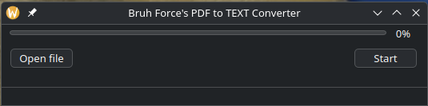

# Bruh Force's PDF to TEXT Converter

A simple and user-friendly PyQt5 application that converts PDF files into editable text using OCR technology.  
Designed especially for extracting text from Turkish medical and dental documents, facilitating easier data handling and research.

---

## Application Screenshot



---

## Features

- Select and open PDF files via a graphical file dialog.  
- Converts each page of the PDF to images and performs OCR to extract text in Turkish (`pytesseract` with `lang="tur"`).  
- Displays a progress bar to keep the user informed during conversion.  
- Saves the extracted text as a `.txt` file alongside the original PDF.  
- User-friendly error handling for missing file selection.

---

## Installation

Install the necessary Python packages via pip:

```bash
pip install -r requirements.txt
```

How to Run
```bash
python main.py
```

Usage

    Open the application.

    Click Open file to select a PDF document.

    Click Start to begin the OCR conversion process.

    Monitor the progress bar during conversion.

    Upon completion, a text file with extracted content will be saved in the same directory as the original PDF.

About the Project

I am a dental student with a passion for coding and developing practical tools to assist with medical data processing and research.
This project reflects my interdisciplinary interests, combining dentistry and programming to create useful software.
The app is built with PyQt5 for the interface and uses OCR technology to extract text from scanned PDFs, especially suited for Turkish documents.
License

MIT License
Notes

    Please ensure all system dependencies are installed correctly for pdf2image and pytesseract to work.

    The OCR quality depends on the PDF's scan quality and clarity.
